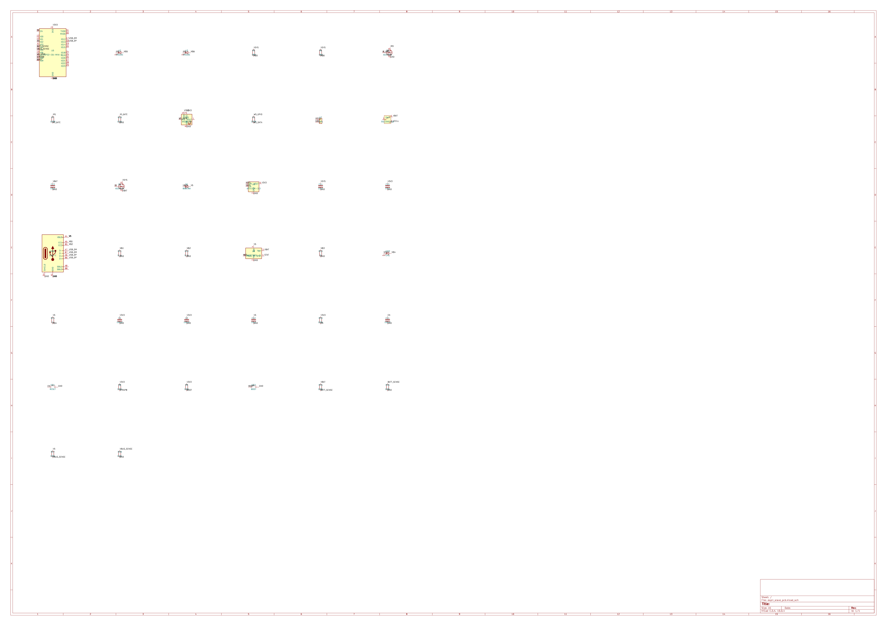
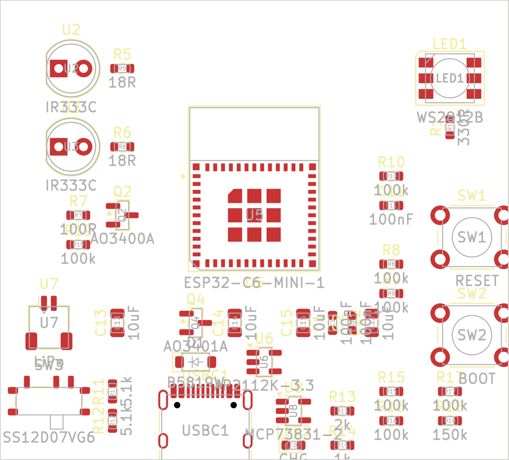
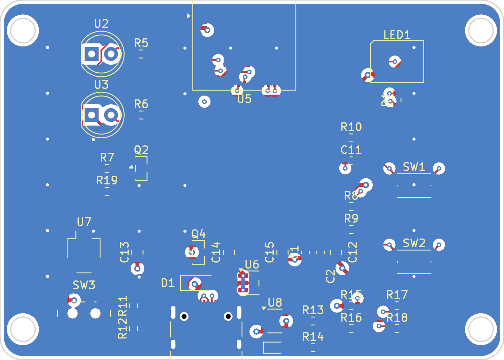

# ESPIR slave PCB — KiCad

The KiCad realization of the ESPIR fully-custom slave board. The original is
captured in EasyEDA Pro (see [`../pcb-fully-custom.md`](../pcb-fully-custom.md));
that board file "lives in the EasyEDA workspace, not in git." This directory is
the same circuit rebuilt **in KiCad**, fully in-repo and reproducible from source.

Schematic (connect-by-name net labels), placement, and the autorouted board:





## What this is

The circuit is described **as code** with [SKiDL](https://github.com/devbisme/skidl)
(`espir_slave_pcb.py`) — a Python netlist HDL that looks up real KiCad library
symbols and emits an authoritative KiCad netlist. From that one netlist:
`make_schematic.py` generates an openable **`.kicad_sch`** (every part + a net
label on each pin — connect-by-name), and `kinet2pcb` + a `pcbnew` script produce
the **`.kicad_pcb`** (footprints, nets, functional placement, board outline).

```
                    ┌─ make_schematic.py ─▶  espir_slave_pcb.kicad_sch  (schematic)
espir_slave_pcb.py ─┤  (+ SKiDL ERC)
   (the circuit)    └─ espir_slave_pcb.net ─ kinet2pcb ─▶ espir_slave_pcb.kicad_pcb ─ place_and_outline.py
```

| File | What |
|------|------|
| `espir_slave_pcb.py`     | **The circuit** — SKiDL source (parts + nets). The schematic-of-record. |
| `espir_slave_pcb.net`    | Generated KiCad netlist (authoritative connectivity). |
| `make_schematic.py`      | netlist → `.kicad_sch` (real symbols embedded; connect-by-name labels). |
| `espir_slave_pcb.kicad_sch` | KiCad schematic: 38 components, 25 nets — connectivity is an **exact match** to the netlist. |
| `place_and_outline.py`   | `pcbnew` pass: 4-layer setup + functional placement + Edge.Cuts + Power/IR net classes. |
| `route.sh`               | Autoroute via Freerouting (DSN → SES). KiCad has no built-in headless autorouter. |
| `pour_gnd.py`            | GND pours on all 4 layers + solid GND-pad connection + collision-checked via stitching. `planes-only` mode pours the planes without stitching (run before routing). |
| `fix_silk.py`            | Collision-aware silkscreen designator placement; hides refs with no clear spot. |
| `en_jumper.py`           | Jumpers the LDO EN→VIN tie on B.Cu (boxed pins Freerouting can't tie). |
| `mounting_and_round.py`  | Expand X (centred), round the corners (r=3 mm), add 4× M3 mounting holes. |
| `swap_smd_button.py`     | Swap one button THT→SMD on the routed board (bridge signal, reconnect inner layers via a via, GND via pour). |
| `espir_slave_pcb.kicad_pcb` | **4-layer** KiCad board: 38 footprints, **fully routed**, 0.5 mm power incl. VBAT, GND planes, centred on A4. |
| `espir_slave_pcb.kicad_dru` | Critical-signal **routing rules** (power width, IR-pulse width, sense-vs-IR clearance, USB width) — DRC auto-enforces them. |
| `espir_slave_pcb.kicad_pro` | KiCad project (open this). |
| `build.sh`               | Reproduces everything from source. |

> The schematic uses **connect-by-name net labels** (a label on every pin) rather
> than drawn wires — the standard scriptable way to express a netlist graphically.
> KiCad re-extracts the identical 25-net netlist from it (verified). Its ERC items
> (off-grid label endpoints, floating NC pins, power-pin-not-driven, lib-symbol
> cache mismatch) are cosmetic, not connectivity errors. Drawing wires / tidy
> placement is GUI finishing work.

## Adjustment vs the EasyEDA discrete-C6 board

Per request this build uses the **ESP32-C6-MINI-1 module** instead of the bare
ESP32-C6 QFN-40. The module integrates the SPI flash, 40 MHz crystal + load caps,
RF chip antenna + π-match, and the EP grounding — so the circuit **drops** those
discrete parts entirely:

| Dropped (now internal to the module) | Was in the discrete design |
|---|---|
| `U4` W25Q32 flash + decoupling | external SPI flash |
| `X1` 40 MHz crystal + `C9`/`C10` | external crystal + load caps |
| `AE1` chip antenna, `RF1` u.FL, `R2`/`R3`/`R4` π-match | external antenna chain |

Everything else carries over: USB-C + load-share + LiPo-charger power tree,
AP2112K 3V3 LDO, 2-LED discrete IR driver, addressable RGB status LED,
battery/VBUS sense dividers, reset/boot buttons, battery slide switch.

**GPIO remap:** the MINI-1 module does not bring out GPIO11, so the WS2812
status-LED data line moves **GPIO11 → GPIO7** (a free, non-strapping exposed pin).
All other pins are unchanged: IR on GPIO2, battery/VBUS sense on GPIO4/GPIO5,
USB on GPIO12/GPIO13, boot on GPIO9, strap pull-up on GPIO8.

> The `slave-pcb/` firmware would need the same one-line pin change
> (`WS_GPIO 11 → 7`) it already needs for this board family.

## Bill of materials (38 parts)

ESP32-C6-MINI-1 module · AP2112K-3.3 LDO · MCP73831 LiPo charger · AO3401A
load-share P-FET · B5819W (1N5819) OR-ing Schottky · AO3400A IR-driver N-FET ·
2× IR333C 940 nm IR LED · WS2812 RGB status LED · charge LED · USB-C (HRO
TYPE-C-31-M-12) · JST-SH LiPo connector · SS12D07VG6 slide switch · 2× SMD tactile (KMR2)
buttons · 17 resistors · 7 capacitors. Full values + LCSC numbers are in
[`../pcb-fully-custom.md`](../pcb-fully-custom.md).

## Build / reproduce

```bash
sudo pacman -S --needed kicad kicad-library kicad-library-3d  # -3d = component 3D models
python -m venv --system-site-packages .venv && . .venv/bin/activate
pip install skidl kinet2pcb
./build.sh
```

> Without `kicad-library-3d` the 3D viewer shows only bare pads on green FR4. The
> ESP32-C6-MINI-1 module has no stock 3D model (renders as pads even with it installed);
> add the vendor STEP and point U5's footprint `(model …)` at it if you want its body.

## Verification

- **ERC (SKiDL): 0 errors.** The 18 warnings are all *intentional* unconnected
  pins — the module's spare GPIOs (IO0/1/3/6/14/15/18–23, RXD0/TXD0), the USB-C
  SBU pins, the slide-switch OFF throw, and the WS2812 DOUT (no daisy-chain).
  Every wired pin lands on the right net.
- **Schematic (`kicad-cli sch export netlist`):** KiCad loads the generated
  `.kicad_sch` and re-extracts the **exact same 25 multi-pin nets** as the SKiDL
  netlist (verified set-equal). The schematic is a faithful graphical view of the
  circuit.
- **4-layer stackup** (F / In1 / In2 / B) with **GND pours on all four layers** + a
  collision-checked stitching-via grid — the inner copper acts as ground reference planes
  for stability. The extra routing room lets **every power rail, incl. VBAT, route at 0.5 mm**.
- **Pour order: GND planes are poured *before* routing** (`pour_gnd.py planes-only`), so the
  Specctra DSN exports GND as `(plane …)` per layer and Freerouting routes **only the signal
  nets** — no redundant GND traces, just the pad-to-plane vias GND needs. A full `pour_gnd.py`
  after routing re-fills around the new tracks and adds stitching.
- **Routing (`route.sh` → Freerouting, 4-layer):** **fully routed — 114/114** (310 tracks,
  43 vias incl. stitching). All `Power`-class rails are 0.5 mm. The LDO EN pin (tied to VSYS,
  boxed between U6's VIN/GND pins) is jumpered VIN→EN on B.Cu under the GND pin.
- **Module placement:** U5's body is at the **top edge so the antenna `tracks not_allowed`
  keep-out hangs OFF the board** — otherwise it covers the interior and the parts under it
  can't route.
- **Board centred** on the A4 drawing sheet (148.5, 105 mm).
- **Mechanical: 66 × 47 mm, rounded corners (r=3 mm), 4× M3 mounting holes** in the
  expanded left/right margins (clear of all components; GND pour isolates them).
- **DRC (`kicad-cli pcb drc`): 0 electrical violations** — 0 unconnected, 0 track-width,
  0 clearance, 0 copper-edge, 0 shorts. Remaining: **4 `silk_edge_clearance`** (U5 antenna +
  USB-C outlines overhanging their edges, by design — fab clips edge silk) and **1
  `lib_footprint_mismatch`** (U5 board copy vs the latest library version — same 61 pads,
  benign). LED2/USBC1 silk refs hidden (saturated cluster; still in BOM/CPL).

## Remaining work (the human finishing pass)

Same division of labour the EasyEDA workflow uses — the circuit + a clean,
function-grouped starting layout are done; the fab finishing is left to a human:

1. **Edge clearance for passives:** `place_and_outline.py` now enforces ≥1 mm board-edge
   clearance for every non-port/antenna part and places the USB-C CC pulldowns right at the
   connector. In the **committed board** the charge LED (LED2) + its ballast (R14) still sit
   ~0.8 mm from the bottom edge (within fab spec, but tight). Pushing them further means
   re-placing the dense USB-C/charger/divider cluster — a fresh `build.sh` regen applies the
   improved placement, but the bottom-center density leaves the **LDO EN tie + IR gate stub**
   for a short KiCad GUI routing session (interactive routing handles them trivially). The
   committed `.kicad_pcb` stays the verified-clean artifact.
2. **Optional polish:** trim U5/USB-C footprint silk that overhangs the edges (the 4 benign
   `silk_edge_clearance`), or leave it (fab clips it). For a true 90 Ω USB pair, rename
   `USB_DM`/`USB_DP` → `USB_D-`/`USB_D+`, set the stackup, Route → Differential Pair + Tune Skew.
2. ~~GND copper pours~~ — done (`pour_gnd.py`: all 4 layers + stitching vias).
3. Nudge silkscreen, confirm the **antenna keep-out** is clear of copper and the
   module antenna overhangs the top edge, verify **edge connectors** (USB-C bottom,
   JST left, buttons right) sit flush at their edges.
4. Set net-class track widths (Power/IR already declared in the project) and
   export Gerber/BOM/CPL.
